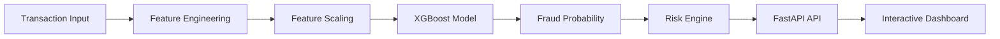

<div align="center">

🛡️ FraudShield AI
Enterprise Financial Fraud Detection Platform

# 🛡️ FraudShield AI

### Enterprise Financial Fraud Detection Platform

Detect suspicious financial transactions in real time using an **XGBoost-powered Machine Learning model** trained on **6.3 Million PaySim transactions**.

<p>


</p>

### ⚡ Enterprise AI • Explainable Predictions • Real-time Detection

</div>

---

## 📸 Dashboard Preview

Screenshots and a live demo will be added after deployment.

---

## 🎥 Live Demo

Coming soon after deployment.

---

# ✨ Features

✅ Enterprise-grade Fraud Detection

✅ Real-time Prediction (<100 ms)

✅ XGBoost Machine Learning Model

✅ Explainable AI Risk Indicators

✅ Fraud Probability Score

✅ Risk Classification (LOW / MEDIUM / HIGH / CRITICAL)

✅ Natural Language Investigation Summary

✅ Batch Prediction Support

✅ Interactive Dashboard

✅ REST API (FastAPI)

✅ Professional Dark-Themed UI

---

# 🚀 Project Highlights

| Feature | Description |
|----------|-------------|
| 🧠 Machine Learning | XGBoost Binary Classifier |
| ⚡ Inference | Sub-100ms Prediction |
| 📊 Dataset | 6.3 Million PaySim Transactions |
| 📈 ROC-AUC | **0.9997** |
| 🎯 Fraud Recall | **99%** |
| 🔍 Explainability | Risk Factors + AI Summary |
| 🌐 Backend | FastAPI |
| 💻 Frontend | HTML • CSS • JavaScript |

---

# 🏗 Architecture



---

# ⚙ How It Works

### Step 1 — Transaction Input

The user enters:

- Transaction Type
- Amount
- Sender Balance Before
- Sender Balance After
- Receiver Balance Before
- Receiver Balance After

↓

### Step 2 — Feature Engineering

The raw transaction is transformed into model-ready features including:

- Transaction encoding
- Log-scaled amount
- Balance deltas
- Account-drained flag
- Amount-to-balance ratio
- Destination anomaly detection

↓

### Step 3 — ML Prediction

The engineered features are passed through a trained **XGBoost Classifier**.

Output:

- Fraud Probability
- Confidence Score

↓

### Step 4 — Decision Engine

Prediction probability is compared against the calibrated production threshold.

The transaction is classified as:

- LOW
- MEDIUM
- HIGH
- CRITICAL

↓

### Step 5 — Explainability Layer

FraudShield automatically identifies why the prediction occurred.

Examples:

- Large Transaction Amount
- Sender Account Fully Drained
- High Risk Transaction Type
- New Destination Account

↓

### Step 6 — Dashboard

Results are displayed inside the enterprise dashboard with:

- Fraud Probability
- Risk Level
- AI Summary
- Risk Indicators
- Confidence Score

---

# 📊 Model Performance

| Metric | Score |
|---------|------:|
| ROC-AUC | ⭐ **0.9997** |
| Precision | ⭐ **99.24%** |
| Recall | ⭐ **99%** |
| F1 Score | ⭐ **0.9948** |
| Dataset Size | ⭐ **6.3 Million Transactions** |

---

# 🖥 Dashboard

### Home Page

<p align="center">

</p>

---

### Fraud Detection Result

<p align="center">

</p>

---

### Investigation Summary

<p align="center">

</p>

---

# 🛠 Tech Stack

| Category | Technologies |
|-----------|--------------|
| Frontend | HTML, CSS, JavaScript |
| Backend | FastAPI, Uvicorn |
| Machine Learning | XGBoost |
| Data Processing | Pandas, NumPy |
| Model Utilities | Scikit-Learn |
| Dataset | PaySim |
| API Validation | Pydantic |

---

# 📂 Project Structure

```text
FraudShield-AI
│
├── api
│   └── app.py
│
├── frontend
│   ├── index.html
│   ├── avatar.jpg
│   └── favicon.ico
│
├── models
│   ├── train.py
│   ├── main.py
│   ├── features.py
│   ├── scaler.pkl
│   ├── threshold.pkl
│   ├── xgb_fraud.json
│   ├── feature_names.pkl
│   └── feature_importance.csv
│
├── screenshots
│
├── tests
│
├── requirements.txt
│
└── README.md
```

---

# 📦 Installation

Clone the repository

```bash
git clone https://github.com/Aarya0706/fraud-detection-api.git

cd fraud-detection-api
```

Create virtual environment

```bash
python -m venv .venv
```

Activate

Windows

```bash
.venv\Scripts\activate
```

Linux/macOS

```bash
source .venv/bin/activate
```

Install dependencies

```bash
pip install -r requirements.txt
```

Run API

```bash
uvicorn api.app:app --reload
```

Open

```
frontend/index.html
```

---

# 🌐 API Endpoints

## POST /predict

Returns

- Fraud Probability
- Risk Level
- Confidence
- AI Summary
- Risk Indicators

---

## POST /predict/batch

Predict multiple transactions simultaneously.

---

## GET /health

Health Check Endpoint.

---

## GET /model/info

Returns model metadata and performance information.

---

# 🧪 Sample Prediction

```json
{
  "type": "TRANSFER",
  "amount": 800000,
  "oldbalanceOrg": 900000,
  "newbalanceOrig": 0,
  "oldbalanceDest": 0,
  "newbalanceDest": 800000
}
```

Response

```json
{
  "fraud_probability": 96.66,
  "risk_level": "CRITICAL",
  "confidence": "96.66%",
  "model": "XGBoost",
  "summary": "Large transfer with drained sender account and zero-balance destination account."
}
```

---

# 🚀 Future Improvements

- 🤖 LLM-generated Investigation Reports
- 📊 SHAP Explainability
- ☁ Cloud Deployment
- 🐳 Docker Support
- 👥 Authentication
- 📈 Admin Analytics Dashboard
- 📱 Mobile Dashboard

---

# 👨‍💻 Author

## Aarya Shirsath

B.Tech Computer Science Engineering  
VIT Bhopal University

<p>

<a href="https://github.com/Aarya0706">

</a>

<a href="https://www.linkedin.com/in/aarya-shirsath-9b7684340/">

</a>

</p>

---

<div align="center">

### ⭐ If you like this project, consider giving it a Star!

Made with ❤️ by **Aarya Shirsath**

</div>