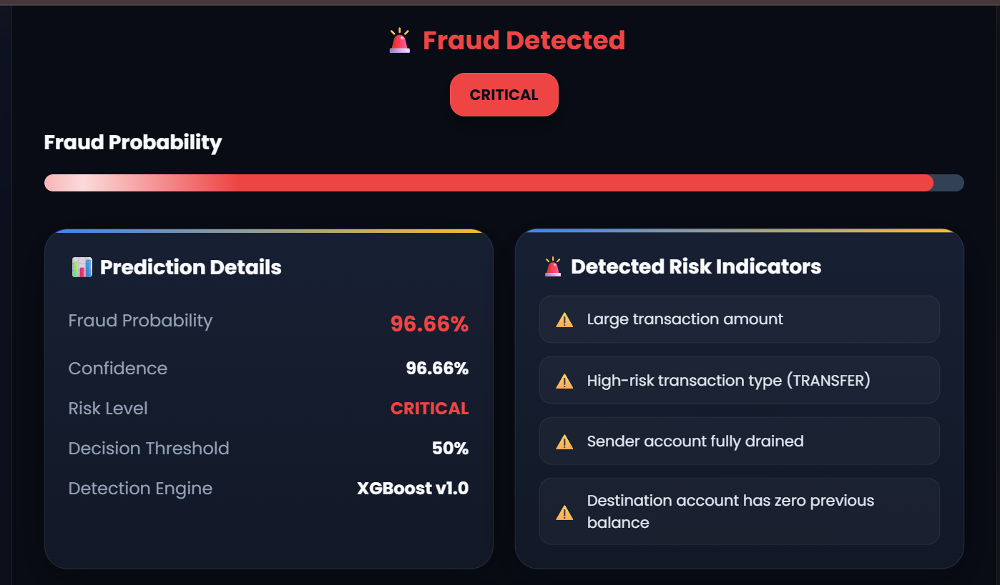
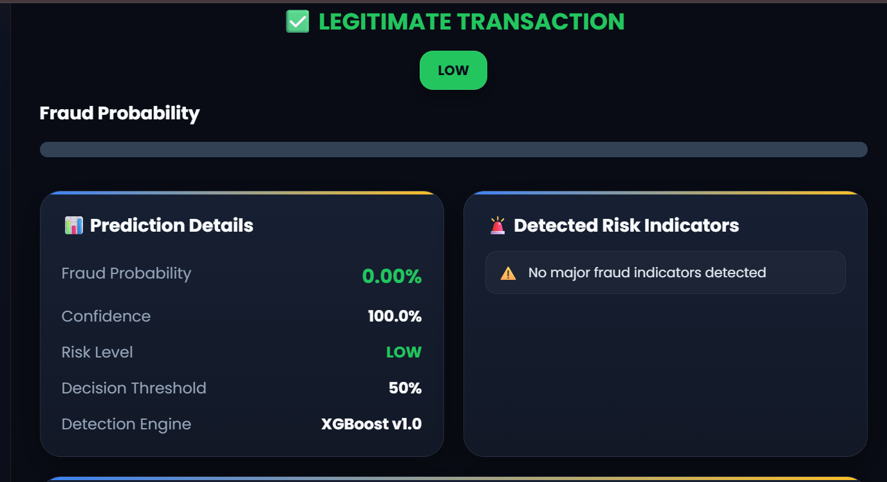
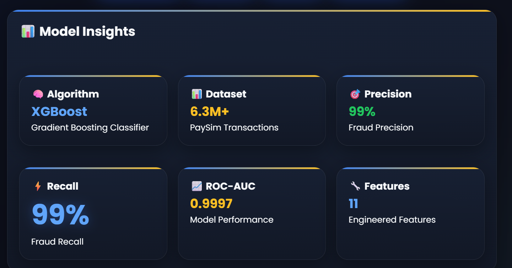
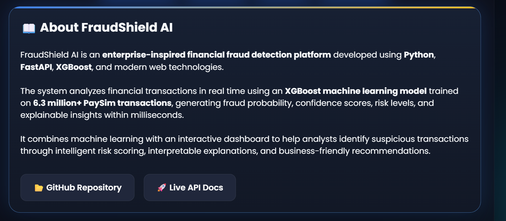
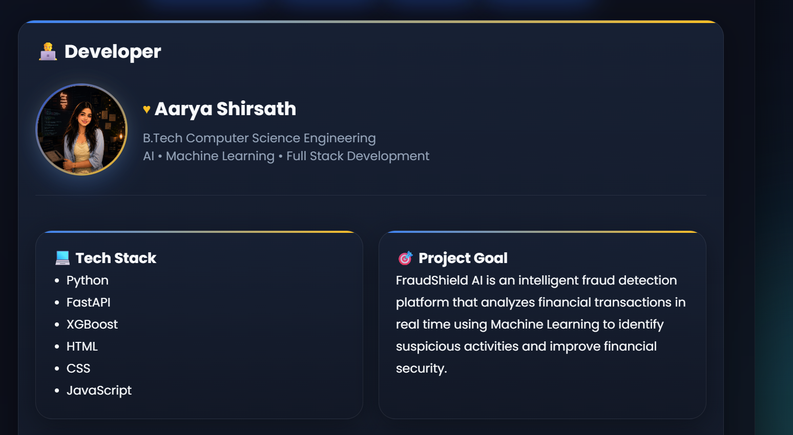
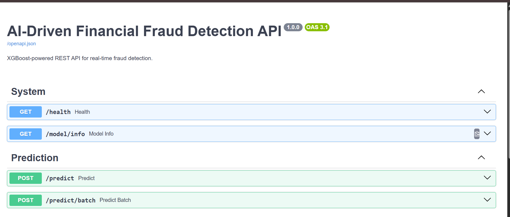
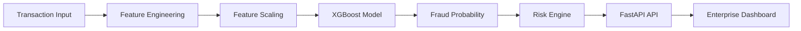

<div align="center">

# 🛡️ FraudShield AI

### Enterprise Financial Fraud Detection Platform

Detect suspicious financial transactions in real time using an **XGBoost-powered Machine Learning model** trained on **6.3+ Million PaySim transactions**.

<p>


</p>

<p>


</p>

### ⚡ Real-Time Fraud Detection • Explainable AI • Enterprise Dashboard

</div>

---

# 🎥 Live Demo

<p align="center">

</p>

<div align="center">

*A 15–20 second walkthrough of a transaction being submitted, scored, and explained in real time.*

</div>

| Service | Link |
|---------|------|
| 🚀 Frontend | https://fraud-detection-api-eta.vercel.app |
| ⚙ Backend API | https://fraud-detection-api-production-f9a6.up.railway.app |
| 📚 API Documentation | https://fraud-detection-api-production-f9a6.up.railway.app/docs |

---

# 💡 Why FraudShield AI?

Financial fraud causes billions of dollars in losses every year.

FraudShield AI demonstrates how modern machine learning can be deployed as a production-ready fraud detection platform. The project combines an XGBoost classifier, FastAPI backend, and an interactive dashboard to provide real-time fraud scoring with explainable predictions.

It was designed to simulate how fraud detection systems operate in fintech and banking environments.

---

# 📖 About

FraudShield AI is an enterprise-inspired fraud detection platform that combines **Machine Learning**, **FastAPI**, and a modern interactive dashboard to detect suspicious financial transactions in real time.

The application predicts fraud probability, classifies transaction risk, explains the prediction using interpretable risk indicators, and exposes a production-style REST API.

---

# 🚀 Project Highlights

- 🌐 Live Full-Stack Deployment
- 🧠 Explainable AI
- 📊 Enterprise Dashboard
- ⚡ REST API
- 📈 Production Metrics
- 🔍 Fraud Investigation

---

# 📸 Application Preview

## 🏠 Home Dashboard

<p align="center">

</p>

---

## 🚨 Fraud Detection Result

<p align="center">

</p>

---

## ✅ Legitimate Transaction Prediction

<p align="center">

</p>

---

## 📊 Model Insights

<p align="center">

</p>

---

## 📖 About Page

<p align="center">

</p>

---

## 👩‍💻 Developer Section

<p align="center">

</p>

---

## 📚 Interactive API Documentation

<p align="center">

</p>

---

# ✨ Features

| Feature | Description |
|---------|-------------|
| 🧠 Machine Learning | XGBoost Binary Classifier |
| ⚡ FastAPI Backend | Production-style REST API |
| 🌐 Interactive Dashboard | Responsive HTML/CSS/JS frontend |
| 📈 Fraud Probability | Confidence-based prediction |
| 🚨 Risk Classification | LOW / MEDIUM / HIGH / CRITICAL |
| 📊 Explainable AI | Risk factors & investigation summary |
| 📦 Batch Prediction | Multiple transactions supported |
| 📚 Swagger Docs | Interactive API testing |

---

# 🏗 System Architecture



---

# 🌍 Deployment Architecture

```text
 Browser
     │
     ▼
Vercel Frontend
     │
fetch("/predict")
     │
     ▼
Railway FastAPI
     │
     ▼
XGBoost Model
     │
     ▼
Prediction JSON
```

---

# 🔄 API Response Flow

```text
User Input
    │
    ▼
Feature Engineering
    │
    ▼
XGBoost Model
    │
    ▼
Fraud Probability
    │
    ▼
Risk Classification
    │
    ▼
AI Summary
    │
    ▼
Dashboard
```

---

# ⚙ How It Works

## 1️⃣ Transaction Input

The user enters:

- Transaction Type
- Amount
- Sender Balance
- Receiver Balance
- Transaction Metadata

↓

## 2️⃣ Feature Engineering

The system creates model-ready features including:

- Transaction Encoding
- Log Amount
- Balance Difference
- Account Drain Flag
- Destination Account Risk
- Amount Ratio

↓

## 3️⃣ Machine Learning Prediction

The engineered features are passed through the trained **XGBoost Classifier**.

Outputs:

- Fraud Probability
- Confidence Score

↓

## 4️⃣ Decision Engine

The prediction is compared with the production threshold and categorized into:

- 🟢 LOW
- 🟡 MEDIUM
- 🟠 HIGH
- 🔴 CRITICAL

↓

## 5️⃣ Explainability Layer

FraudShield identifies the major reasons behind the prediction.

Example risk indicators:

- Large Transaction
- Fully Drained Sender
- High Risk Transaction Type
- New Destination Account

↓

## 6️⃣ Dashboard

The enterprise dashboard displays:

- Fraud Probability
- Risk Level
- Confidence Score
- AI Summary
- Risk Factors

---

# 📊 Model Performance

| Metric | Score |
|---------|------:|
| ROC-AUC | ⭐ 0.9997 |
| Precision | ⭐ 99.24% |
| Recall | ⭐ 99.00% |
| F1 Score | ⭐ 0.9948 |
| Dataset | ⭐ 6.3+ Million Transactions |

---

# 📈 Project Statistics

- ✔ 6.3 Million PaySim Transactions
- ✔ 11 Engineered Features
- ✔ XGBoost Binary Classifier
- ✔ ROC-AUC: 0.9997
- ✔ Precision: 99.24%
- ✔ Recall: 99%
- ✔ Sub-100ms Inference
- ✔ Vercel + Railway Deployment

---

# 🛠 Tech Stack

**Backend**
Python • FastAPI • Uvicorn

**Machine Learning**
XGBoost • Scikit-Learn • Pandas • NumPy

**Frontend**
HTML5 • CSS3 • JavaScript

**Deployment**
Vercel • Railway

| Category | Technology |
|-----------|------------|
| Frontend | HTML5, CSS3, JavaScript |
| Backend | FastAPI, Uvicorn |
| Machine Learning | XGBoost |
| Data Processing | Pandas, NumPy |
| Utilities | Scikit-Learn, Joblib |
| Validation | Pydantic |
| Deployment | Vercel + Railway |
| Dataset | PaySim |

---

# 📂 Project Structure

```text
fraud-detection-api
│
├── api
│   └── app.py
│
├── frontend
│   ├── index.html
│   ├── avatar.jpg
│   └── favicon.ico
│
├── models
│   ├── train.py
│   ├── main.py
│   ├── features.py
│   ├── scaler.pkl
│   ├── threshold.pkl
│   ├── xgb_fraud.json
│   ├── feature_names.pkl
│   └── feature_importance.csv
│
├── screenshots
│
├── tests
│
├── requirements.txt
├── runtime.txt
└── README.md
```

---

# 🚀 Installation

## Clone Repository

```bash
git clone https://github.com/Aarya0706/fraud-detection-api.git
cd fraud-detection-api
```

## Create Virtual Environment

```bash
python -m venv .venv
```

Windows

```bash
.venv\Scripts\activate
```

Linux / macOS

```bash
source .venv/bin/activate
```

## Install Dependencies

```bash
pip install -r requirements.txt
```

## Start FastAPI

```bash
uvicorn api.app:app --reload
```

Open

```
frontend/index.html
```

---

# 🌐 REST API

| Method | Endpoint | Description |
|---------|----------|-------------|
| POST | /predict | Predict one transaction |
| POST | /predict/batch | Batch prediction |
| GET | /health | API health |
| GET | /model/info | Model information |

---

# 🧪 Sample Prediction

### Request

```json
{
  "type": "TRANSFER",
  "amount": 800000,
  "oldbalanceOrg": 900000,
  "newbalanceOrig": 0,
  "oldbalanceDest": 0,
  "newbalanceDest": 800000
}
```

### Response

```json
{
  "fraud_probability": 96.66,
  "risk_level": "CRITICAL",
  "confidence": "96.66%",
  "model": "XGBoost",
  "summary": "Large transfer with drained sender account and zero-balance destination account."
}
```

---

# 🛣 Roadmap

- [x] Real-time fraud prediction
- [x] FastAPI backend
- [x] Vercel deployment
- [x] Railway deployment
- [x] Interactive dashboard
- [ ] SHAP explainability
- [ ] Docker support
- [ ] User authentication
- [ ] Persistent transaction history

---

# 🚀 Future Enhancements

- 🤖 LLM-powered Investigation Reports
- 📊 SHAP Explainability
- 🐳 Docker Deployment
- ☁ Kubernetes Support
- 👤 Authentication & RBAC
- 📈 Enterprise Analytics Dashboard
- 📱 Mobile Version

---

# 📄 License

This project is licensed under the MIT License. See the [LICENSE](LICENSE) file for details.

---

# 👩‍💻 Developer

<p align="center">

</p>

## Aarya Shirsath

B.Tech Computer Science Engineering
VIT Bhopal University

### Connect with me

<p>

<a href="https://github.com/Aarya0706">

</a>

<a href="https://www.linkedin.com/in/aarya-shirsath-9b7684340/">

</a>

</p>

---

<div align="center">

⭐ If you found this project useful, consider giving it a star.

Made with ❤️ by **Aarya Shirsath**

B.Tech CSE • VIT Bhopal University

</div>
