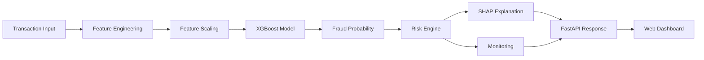

<div align="center">

# 🛡️ FraudShield AI

### Real-Time Financial Fraud Detection with Explainable Machine Learning

A production-style fraud detection platform powered by **XGBoost**, **FastAPI**, and an interactive web dashboard. Trained on **6.86M PaySim transactions** with pre-transaction features and deployed using **Vercel + Render**.

<p>


</p>

**⚡ Real-Time Scoring · SHAP Explainability · Risk Classification · Batch Prediction · API Monitoring**

</div>

---

## 🌐 Live Demo

| Service         | Link                                               |
| --------------- | -------------------------------------------------- |
| 🚀 Frontend     | https://fraud-detection-api-eta.vercel.app         |
| ⚙️ Backend API  | https://fraud-detection-api-w9hz.onrender.com      |
| 📚 Swagger Docs | https://fraud-detection-api-w9hz.onrender.com/docs |

> **Note:** The backend uses Render's free tier and may take around **30–50 seconds** to wake after inactivity. Subsequent requests are significantly faster.

---

## 📸 Screenshots

### Dashboard

<p align="center">

</p>

### Fraud Detection

<p align="center">

</p>

### Legitimate Transaction

<p align="center">

</p>

### Model Insights

<p align="center">

</p>

---

## ✨ Features

* 🧠 **XGBoost fraud classifier**
* ⚡ **FastAPI REST API**
* 📈 Fraud probability and confidence scoring
* 🚦 **LOW / MEDIUM / HIGH / CRITICAL** risk classification
* 🔎 **Per-prediction SHAP explanations**
* 📦 Batch prediction support
* 📊 Runtime prediction monitoring
* 🛡️ Rate limiting
* 🔐 Optional API-key authentication
* 🌍 Configured CORS protection
* 📚 Interactive Swagger/OpenAPI documentation
* 🌐 Live Vercel + Render deployment

---

## 🏗️ Architecture


```mermaid
flowchart LR

A[Transaction Input] --> B[Feature Engineering]
B --> C[Feature Scaling]
C --> D[XGBoost Model]
D --> E[Fraud Probability]
E --> F[Risk Engine]
F --> G[SHAP Explanation]
F --> H[Monitoring]
G --> I[FastAPI Response]
H --> I
I --> J[Web Dashboard]
```

### Deployment

```text
Browser
   │
   ▼
Vercel Frontend
   │
   │ HTTPS / JSON
   ▼
Render FastAPI
   │
   ├── Feature Engineering
   ├── XGBoost Inference
   ├── SHAP Explanation
   └── Prediction Monitoring
   │
   ▼
Prediction Response
```

---

## 🔬 How It Works

### 1. Transaction Input

The prediction API accepts:

```text
type
amount
oldbalanceOrg
oldbalanceDest
recency_hours
txn_count_24h
is_dest_new
```

Post-transaction fields such as `newbalanceOrig` and `newbalanceDest` are **not used**, avoiding direct post-transaction information leakage.

### 2. Feature Engineering

The model uses **10 engineered features**, including:

* Transaction type encoding
* Log-transformed transaction amount
* Sender/receiver balance transformations
* Amount-to-balance ratio
* Account-drain indicator
* Destination balance anomaly
* New-destination indicator
* Transaction recency
* 24-hour transaction count

### 3. Model Prediction

The XGBoost classifier outputs a fraud probability between **0 and 1**.

The current F1-optimized decision threshold is approximately:

```text
0.984
```

### 4. Risk Classification

```text
< 0.30        → LOW
0.30–0.59     → MEDIUM
0.60–0.84     → HIGH
≥ 0.85        → CRITICAL
```

### 5. Explainability

Predictions can include:

* Top rule-based risk factors
* Top SHAP feature contributions
* Direction of each contribution
* Human-readable prediction summary

---

## 📊 Model Performance

Current metrics from the latest training run:

| Metric        |         Score |
| ------------- | ------------: |
| ROC-AUC       |    **0.9997** |
| PR-AUC        |    **0.9933** |
| Precision     |    **95.39%** |
| Recall        |    **95.68%** |
| F1 Score      |    **0.9553** |
| Accuracy      |    **99.99%** |
| Training Rows | **5,591,878** |
| Test Rows     | **1,272,524** |
| Total Rows    | **6,864,402** |
| Features      |        **10** |
| F1 Threshold  |    **0.9839** |

### ⚠️ Important

These metrics are **PaySim benchmark results**, not a guarantee of real-world banking performance.

PaySim is a synthetic dataset whose fraud-generation process differs from real financial systems. The feature `would_drain_orig` contributes roughly **57% of feature importance** and strongly aligns with PaySim's synthetic fraud pattern.

Therefore, the **0.9997 ROC-AUC should be interpreted as a dataset benchmark**, not as expected production accuracy.

---

## 🔌 REST API

| Method | Endpoint               | Description                |
| ------ | ---------------------- | -------------------------- |
| `GET`  | `/health`              | Service health             |
| `GET`  | `/model/info`          | Model metadata and metrics |
| `GET`  | `/metrics/predictions` | Runtime prediction metrics |
| `POST` | `/predict`             | Predict one transaction    |
| `POST` | `/predict/batch`       | Batch prediction           |

Swagger documentation is available at:

```text
/docs
```

### API Protection

```text
/predict        → 30 requests/minute
/predict/batch  → 10 requests/minute
```

Optional API-key authentication can be enabled using:

```text
API_KEY
```

with the request header:

```text
X-API-Key: <your-api-key>
```

The public demo leaves API-key authentication disabled so users can test the application without credentials.

---

## 🧪 Example Request

```json
{
  "type": "TRANSFER",
  "amount": 800000,
  "oldbalanceOrg": 800000,
  "oldbalanceDest": 0,
  "recency_hours": 24.0,
  "txn_count_24h": 1,
  "is_dest_new": 1
}
```

### Response

```json
{
  "fraud_probability": 0.9997,
  "confidence": "99.97%",
  "threshold": "98%",
  "is_fraud": true,
  "risk_level": "CRITICAL",
  "model": "XGBoost Fraud Classifier v1.0",
  "model_version": "<model hash>",
  "top_risk_factors": [
    "Large transaction amount",
    "High-risk transaction type (TRANSFER)",
    "Transaction would fully drain sender account"
  ],
  "shap_top_factors": [
    {
      "feature": "would_drain_orig",
      "direction": "increases risk"
    }
  ],
  "inference_ms": 8.42
}
```

> `fraud_probability` is returned as a **0–1 value**, while `confidence` is formatted as a percentage.

---

## 📈 Monitoring & Model Versioning

The API tracks lightweight runtime information including:

* Model version
* Fraud probability
* Risk level
* Prediction decision
* Inference latency
* Endpoint usage

Runtime metrics are available through:

```text
GET /metrics/predictions
```

The monitoring state is in-memory and resets when the backend process restarts.

Model artifacts use a short **SHA-256 model hash** for version identification.

Training metrics are stored in:

```text
models/metrics.json
```

---

## 🛠️ Tech Stack

| Area           | Technologies                    |
| -------------- | ------------------------------- |
| Backend        | Python, FastAPI, Uvicorn        |
| ML             | XGBoost, Scikit-Learn           |
| Data           | Pandas, NumPy                   |
| Validation     | Pydantic                        |
| API Protection | SlowAPI, CORS, optional API key |
| Frontend       | HTML, CSS, JavaScript           |
| Deployment     | Vercel, Render                  |
| Dataset        | PaySim                          |

---

## 📂 Project Structure

```text
fraud-detection-api/
│
├── api/
│   └── app.py
│
├── models/
│   ├── train.py
│   ├── main.py
│   ├── features.py
│   ├── monitoring.py
│   ├── metrics.json
│   ├── model_registry.jsonl
│   ├── scaler.pkl
│   ├── threshold.pkl
│   ├── xgb_fraud.json
│   ├── feature_names.pkl
│   └── feature_importance.csv
│
├── frontend/
│   ├── index.html
│   ├── avatar.jpg
│   └── favicon.ico
│
├── scripts/
│   ├── verify_would_drain_orig.py
│   └── diagnose_velocity_features.py
│
├── screenshots/
├── tests/
├── requirements.txt
├── requirements-dev.txt
├── runtime.txt
└── README.md
```

---

## 🚀 Run Locally

### Clone

```bash
git clone https://github.com/Aarya0706/fraud-detection-api.git
cd fraud-detection-api
```

### Create Environment

```bash
python -m venv .venv
```

**Windows**

```bash
.venv\Scripts\activate
```

**Linux / macOS**

```bash
source .venv/bin/activate
```

### Install Dependencies

```bash
pip install -r requirements.txt
```

### Start API

```bash
uvicorn api.app:app --reload
```

Open:

```text
http://127.0.0.1:8000/docs
```

---

## 🧪 Training Diagnostics

The project includes diagnostic scripts for evaluating the most influential and temporal features:

```bash
python scripts/verify_would_drain_orig.py
python scripts/diagnose_velocity_features.py
```

Training metrics are automatically written to:

```text
models/metrics.json
```

---

## 🗺️ Roadmap

* [x] Real-time fraud prediction
* [x] FastAPI backend
* [x] Interactive dashboard
* [x] Vercel deployment
* [x] Render deployment
* [x] SHAP explainability
* [x] Model version hashing
* [x] Prediction monitoring
* [x] Rate limiting
* [x] Optional API-key authentication
* [ ] Persistent transaction history
* [ ] User authentication / RBAC
* [ ] LLM-assisted fraud investigation
* [ ] Enterprise analytics dashboard

---

## 👩‍💻 Developer

<p align="center">

</p>

### Aarya Shirsath

**B.Tech Computer Science Engineering**
**VIT Bhopal University**

<p>

<a href="https://github.com/Aarya0706">

</a>

<a href="https://www.linkedin.com/in/aarya-shirsath-9b7684340/">

</a>

</p>

---

<div align="center">

⭐ If you found FraudShield AI useful, consider giving the repository a star.

**Made with ❤️ by Aarya Shirsath**

</div>
