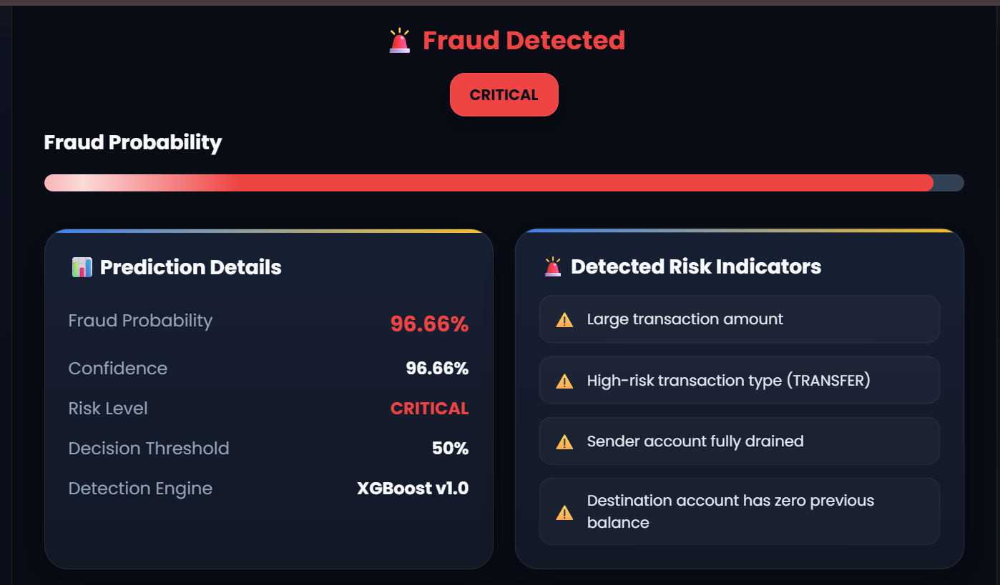
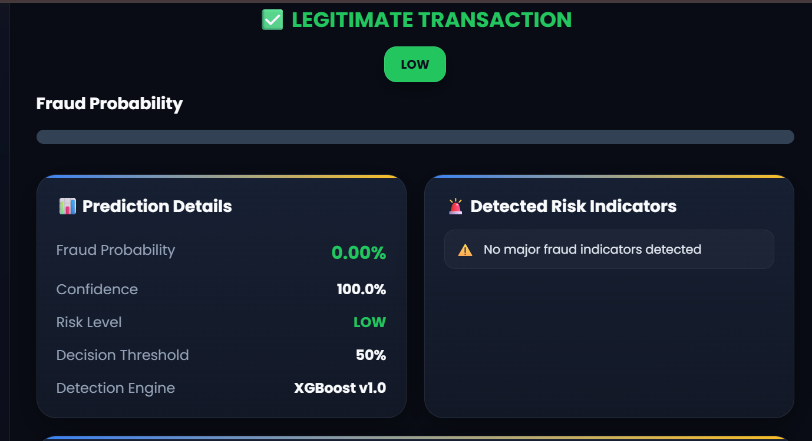
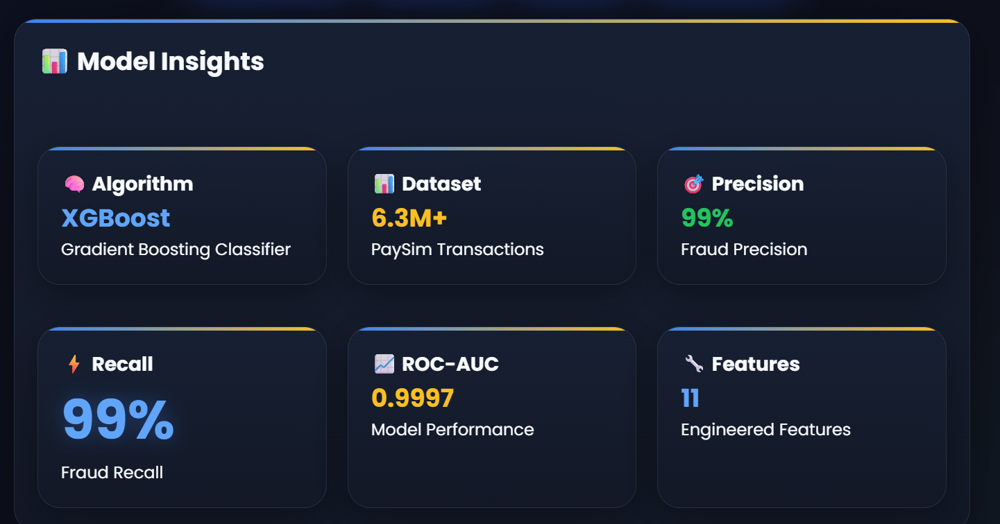
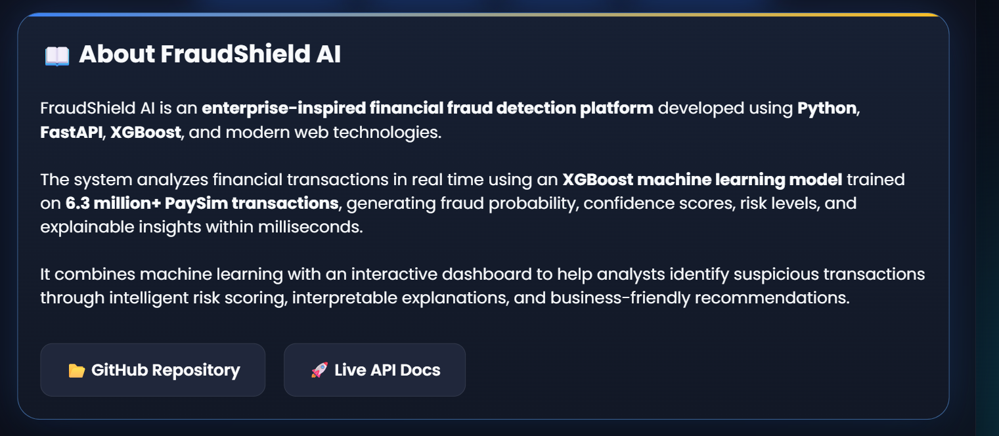
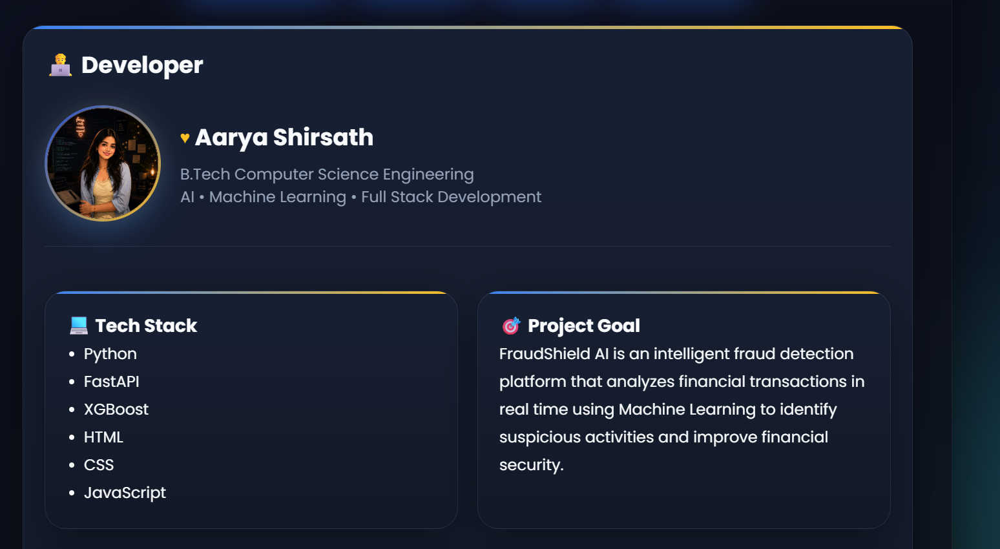
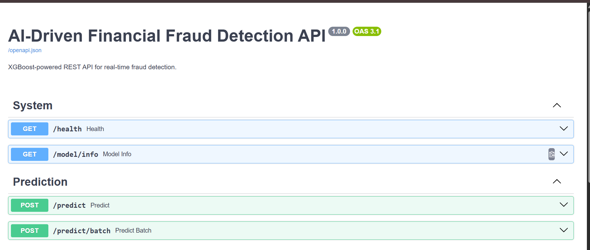
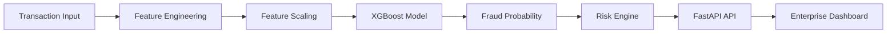

<div align="center">

# 🛡️ FraudShield AI

### Enterprise Financial Fraud Detection Platform

Detect suspicious financial transactions in real time using an **XGBoost-powered Machine Learning model** trained on **6.3+ Million PaySim transactions**.

<p>


</p>

<p>


</p>

### ⚡ Real-Time Fraud Detection • Explainable AI • Enterprise Dashboard

</div>

---

# 🎥 Live Demo

<p align="center">

</p>

<div align="center">

*A transaction flagged CRITICAL, with SHAP attribution and rule-based
risk factors. (Placeholder screenshot — swap for a real screen
recording; see note below.)*

</div>

| Service | Link |
|---------|------|
| 🚀 Frontend | https://fraud-detection-api-eta.vercel.app |
| ⚙ Backend API | https://fraud-detection-api-w9hz.onrender.com |
| 📚 API Documentation | https://fraud-detection-api-w9hz.onrender.com/docs |

---

# 💡 Why FraudShield AI?

Financial fraud causes billions of dollars in losses every year.

FraudShield AI demonstrates how modern machine learning can be deployed as a production-ready fraud detection platform. The project combines an XGBoost classifier, FastAPI backend, and an interactive dashboard to provide real-time fraud scoring with explainable predictions.

It was designed to simulate how fraud detection systems operate in fintech and banking environments.

---

# 📖 About

FraudShield AI is an enterprise-inspired fraud detection platform that combines **Machine Learning**, **FastAPI**, and a modern interactive dashboard to detect suspicious financial transactions in real time.

The application predicts fraud probability, classifies transaction risk, explains the prediction using interpretable risk indicators, and exposes a production-style REST API.

---

# 🚀 Project Highlights

- 🌐 Live Full-Stack Deployment
- 🧠 Explainable AI
- 📊 Enterprise Dashboard
- ⚡ REST API
- 📈 Production Metrics
- 🔍 Fraud Investigation

---

# 📸 Application Preview

## 🏠 Home Dashboard

<p align="center">

</p>

---

## 🚨 Fraud Detection Result

<p align="center">

</p>

---

## ✅ Legitimate Transaction Prediction

<p align="center">

</p>

---

## 📊 Model Insights

<p align="center">

</p>

---

## 📖 About Page

<p align="center">

</p>

---

## 👩‍💻 Developer Section

<p align="center">

</p>

---

## 📚 Interactive API Documentation

<p align="center">

</p>

---

# ✨ Features

| Feature | Description |
|---------|-------------|
| 🧠 Machine Learning | XGBoost Binary Classifier |
| ⚡ FastAPI Backend | Production-style REST API |
| 🌐 Interactive Dashboard | Responsive HTML/CSS/JS frontend |
| 📈 Fraud Probability | Confidence-based prediction |
| 🚨 Risk Classification | LOW / MEDIUM / HIGH / CRITICAL |
| 📊 Explainable AI | Real per-prediction SHAP attribution + rule-based risk factors |
| 📦 Batch Prediction | Multiple transactions supported |
| 📚 Swagger Docs | Interactive API testing |

---

# 🏗 System Architecture


```mermaid
flowchart LR

A[Transaction Input]
B[Feature Engineering]
C[Feature Scaling]
D[XGBoost Model]
E[Fraud Probability]
F[Risk Engine]
G[FastAPI API]
H[Enterprise Dashboard]

A --> B
B --> C
C --> D
D --> E
E --> F
F --> G
G --> H
```

---

# 🌍 Deployment Architecture

```text
 Browser
     │
     ▼
Vercel Frontend
     │
fetch("/predict")
     │
     ▼
Render FastAPI
     │
     ▼
XGBoost Model
     │
     ▼
Prediction JSON
```

> **Note on cold starts:** The backend runs on Render's free tier, which
> spins the service down after ~15 minutes of inactivity. If you're
> clicking in from a cold link, the first request can take **30–50
> seconds** to wake it up — that's expected behavior for the free tier,
> not a bug. Subsequent requests are fast (sub-100ms inference).

> **Note on API-key auth:** The API supports optional key-based auth
> (`API_KEY` env var, checked via an `X-API-Key` header on the
> prediction routes) but it's **off by default, intentionally**, for
> this public demo. Abuse protection here comes from rate limiting
> (30/min on `/predict`, 10/min on `/predict/batch`) and CORS restricted
> to known origins, not a key — the goal is for anyone (a recruiter, a
> reviewer) to be able to try the live demo with zero setup friction.
> If this were deployed for real production traffic rather than a
> portfolio demo, turning the key on would be the first thing to flip.

---

# 🔄 API Response Flow

```text
User Input
    │
    ▼
Feature Engineering
    │
    ▼
XGBoost Model
    │
    ▼
Fraud Probability
    │
    ▼
Risk Classification
    │
    ▼
AI Summary
    │
    ▼
Dashboard
```

---

# ⚙ How It Works

## 1️⃣ Transaction Input

The user enters:

- Transaction Type
- Amount
- Sender Balance
- Receiver Balance
- Transaction Metadata

↓

## 2️⃣ Feature Engineering

The system creates model-ready features including:

- Transaction Encoding
- Log Amount
- Balance Difference
- Account Drain Flag
- Destination Account Risk
- Amount Ratio

↓

## 3️⃣ Machine Learning Prediction

The engineered features are passed through the trained **XGBoost Classifier**.

Outputs:

- Fraud Probability
- Confidence Score

↓

## 4️⃣ Decision Engine

The prediction is compared with the production threshold and categorized into:

- 🟢 LOW
- 🟡 MEDIUM
- 🟠 HIGH
- 🔴 CRITICAL

↓

## 5️⃣ Explainability Layer

FraudShield identifies the major reasons behind the prediction.

Example risk indicators:

- Large Transaction
- Fully Drained Sender
- High Risk Transaction Type
- New Destination Account

↓

## 6️⃣ Dashboard

The enterprise dashboard displays:

- Fraud Probability
- Risk Level
- Confidence Score
- AI Summary
- Risk Factors

---

# 📊 Model Performance

> **Note:** These numbers are from the first real training run against the
> full PaySim dataset after the leakage fix (trained 2026-09-06, XGBoost
> 2.0.3) — not the pre-fix, leaky-feature numbers this table used to show.
> Full metrics are saved automatically to `models/metrics.json` on every
> `python -m models.train` run (also surfaced at `GET /model/info`), so
> this table reflects whichever training run produced the currently
> deployed model.

| Metric | Score |
|---------|------:|
| ROC-AUC | 0.9997 |
| PR-AUC | 0.9933 |
| Precision (fraud class) | 95.39% |
| Recall (fraud class) | 95.68% |
| F1 Score (fraud class) | 0.9553 |
| Accuracy | 99.99% |
| Dataset | 6,864,402 rows (5,591,878 train / 1,272,524 test) |

Decision threshold: **0.984**, selected by max-F1 on the precision-recall
curve (`THRESHOLD_STRATEGY=f1`, the current default). A cost-weighted
alternative is also computed each run — see `models/metrics.json` →
`cost_threshold` — but isn't the one currently deployed; switching to it
is on the roadmap below.

### ⚠ Two caveats behind these numbers

**`would_drain_orig` dominates feature importance (~57%).** That's above
this project's own 40% dominance-warning threshold (`train.py`'s
`_check_for_leakage`), so it's been verified rather than assumed —
`scripts/verify_would_drain_orig.py` shows 97.7% of fraud rows fully
drain the sender's account, but only 0.4% of full-drain transactions are
actually fraud. That rules out literal leakage (it's a necessary, not
sufficient, condition, using only pre-transaction data) — but PaySim's
own fraud generator specifically simulates fraud *as* full-account
drains. So this feature is likely closer to "matches PaySim's synthetic
fraud template" than a fully general real-world fraud signal, and the
0.9997 ROC-AUC above should be read with that in mind — it may not
transfer as-is to fraud that doesn't fully drain the account.

**`recency_hours` and `txn_count_24h` carry ~0% importance.**
`scripts/diagnose_velocity_features.py` shows why: PaySim mostly
simulates each sender transacting once or twice across the whole
744-step run, so `recency_hours` sits at its "no prior transaction"
default (720) for 99.85% of rows and `txn_count_24h` is 0 for
essentially everyone — nothing for a tree model to split on. This is a
property of the synthetic dataset, not a bug in the velocity-feature
code; a live deployment with a real transaction log would likely see
far more spread. `is_dest_new`, the third velocity feature, does show a
real (if modest) gap — 42.8% of legitimate transactions hit a new
destination vs. 62.4% of fraud ones — but contributes only ~0.9%
importance, likely crowded out by the two dominant features above.

---

# 📈 Project Statistics

- ✔ 6.86 Million PaySim Transactions (train + test)
- ✔ 10 Engineered Features
- ✔ XGBoost Binary Classifier
- ✔ ROC-AUC 0.9997 · Precision 95.39% · Recall 95.68% (real post-fix numbers, see above)
- ✔ Sub-100ms Inference
- ✔ Vercel + Render Deployment

---

# 🛠 Tech Stack

**Backend**
Python • FastAPI • Uvicorn

**Machine Learning**
XGBoost • Scikit-Learn • Pandas • NumPy

**Frontend**
HTML5 • CSS3 • JavaScript

**Deployment**
Vercel • Render

| Category | Technology |
|-----------|------------|
| Frontend | HTML5, CSS3, JavaScript |
| Backend | FastAPI, Uvicorn |
| Machine Learning | XGBoost |
| Data Processing | Pandas, NumPy |
| Utilities | Scikit-Learn, Joblib |
| Validation | Pydantic |
| Deployment | Vercel + Render |
| Dataset | PaySim |

---

# 📂 Project Structure

```text
fraud-detection-api
│
├── api
│   └── app.py
│
├── frontend
│   ├── index.html
│   ├── avatar.jpg
│   └── favicon.ico
│
├── models
│   ├── train.py
│   ├── main.py
│   ├── features.py
│   ├── scaler.pkl
│   ├── threshold.pkl
│   ├── xgb_fraud.json
│   ├── feature_names.pkl
│   └── feature_importance.csv
│
├── screenshots
│
├── scripts
│   ├── verify_would_drain_orig.py
│   └── diagnose_velocity_features.py
│
├── tests
│
├── requirements.txt
├── requirements-dev.txt
├── runtime.txt
└── README.md
```

---

# 🚀 Installation

## Clone Repository

```bash
git clone https://github.com/Aarya0706/fraud-detection-api.git
cd fraud-detection-api
```

## Create Virtual Environment

```bash
python -m venv .venv
```

Windows

```bash
.venv\Scripts\activate
```

Linux / macOS

```bash
source .venv/bin/activate
```

## Install Dependencies

```bash
pip install -r requirements.txt
```

## Start FastAPI

```bash
uvicorn api.app:app --reload
```

Open

```
frontend/index.html
```

---

# 🌐 REST API

| Method | Endpoint | Description |
|---------|----------|-------------|
| POST | /predict | Predict one transaction |
| POST | /predict/batch | Batch prediction |
| GET | /health | API health |
| GET | /model/info | Model information |

---

# 🧪 Sample Prediction

### Request

```json
{
  "type": "TRANSFER",
  "amount": 800000,
  "oldbalanceOrg": 800000,
  "oldbalanceDest": 0,
  "recency_hours": 24.0,
  "txn_count_24h": 1,
  "is_dest_new": 1
}
```

### Response

```json
{
  "fraud_probability": 0.9997,
  "confidence": "99.97%",
  "threshold": "98%",
  "is_fraud": true,
  "risk_level": "CRITICAL",
  "model": "XGBoost Fraud Classifier v1.0",
  "model_version": "022aa4026592",
  "top_risk_factors": [
    "Large transaction amount",
    "High-risk transaction type (TRANSFER)",
    "Transaction would fully drain sender account",
    "Destination account has zero previous balance"
  ],
  "shap_top_factors": [
    {
      "feature": "would_drain_orig",
      "label": "Transaction would fully drain sender's account",
      "shap_value": 4.124,
      "direction": "increases risk"
    },
    {
      "feature": "amount_ratio_orig",
      "label": "Amount as a share of sender's balance",
      "shap_value": 3.645,
      "direction": "increases risk"
    },
    {
      "feature": "log_oldbalanceOrg",
      "label": "Sender's balance before the transaction",
      "shap_value": 2.8347,
      "direction": "increases risk"
    }
  ],
  "summary": "This TRANSFER transaction of ₹800,000.00 has been flagged as CRITICAL risk with a fraud probability of 99.97%. Key risk indicators include: Large transaction amount, High-risk transaction type (TRANSFER), Transaction would fully drain sender account, Destination account has zero previous balance.",
  "inference_ms": 8.42
}
```

> Generated from a real `predict_fraud()` call against the currently
> deployed model (`model_version` above), not hand-written -- the
> previous version of this example used `newbalanceOrig` /
> `newbalanceDest` fields the API no longer accepts (removed as part of
> the leakage fix above), and showed `fraud_probability` as a percentage
> rather than the 0–1 fraction the API actually returns. `inference_ms`
> is illustrative; actual latency varies by deployment.

---

# 🛣 Roadmap

- [x] Real-time fraud prediction
- [x] FastAPI backend
- [x] Vercel deployment
- [x] Render deployment
- [x] Interactive dashboard
- [x] SHAP explainability
- [x] Docker support
- [ ] User authentication
- [ ] Persistent transaction history

---

# 🚀 Future Enhancements

- 🤖 LLM-powered Investigation Reports
- ☁ Kubernetes Support
- 👤 Authentication & RBAC
- 📈 Enterprise Analytics Dashboard
- 📱 Mobile Version

---

# 👩‍💻 Developer

<p align="center">

</p>

## Aarya Shirsath

B.Tech Computer Science Engineering
VIT Bhopal University

### Connect with me

<p>

<a href="https://github.com/Aarya0706">

</a>

<a href="https://www.linkedin.com/in/aarya-shirsath-9b7684340/">

</a>

</p>

---

<div align="center">

⭐ If you found this project useful, consider giving it a star.

Made with ❤️ by **Aarya Shirsath**

B.Tech CSE • VIT Bhopal University

</div>
