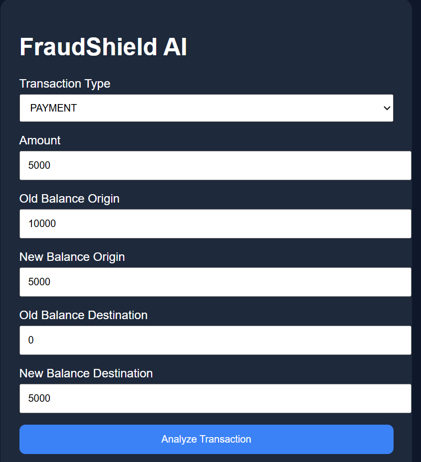
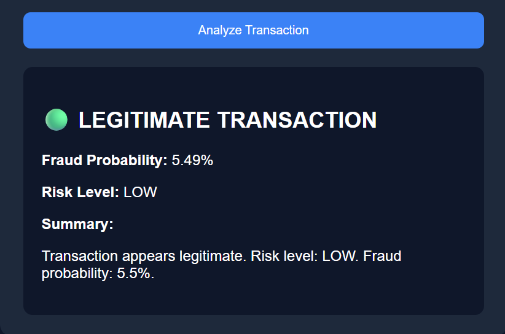

# AI-Driven Financial Fraud Detection System
# AI-Driven Financial Fraud Detection System

AI-powered fraud detection system built using XGBoost, FastAPI, and a custom web interface.

## Application Interface



## Prediction Example



## Features

- Real-time fraud detection
- Fraud probability scoring
- Risk level classification
- FastAPI REST API
- Interactive web interface

> XGBoost + FastAPI + GPT-3.5 | Trained on 6.3 M+ transactions | AUC 0.9998 | Precision 80% | Recall 99% | <100 ms inference

---

## Project Structure

```
fraud_detection/
├── models/
│   ├── train.py          # Data generation + XGBoost training
│   ├── main.py           # Prediction engine + GPT-3.5 explainer
│   ├── xgb_fraud.json    # Saved model (generated after training)
│   ├── scaler.pkl        # Saved scaler (generated after training)
│   └── feature_names.pkl # Feature list (generated after training)
├── api/
│   └── app.py            # FastAPI REST API
├── test_api.py           # API tests
├── .env.example          # Environment variable template
├── requirements.txt      # Python dependencies
└── README.md
```

---

## Setup

### 1. Install dependencies
```bash
pip install -r requirements.txt
```

### 2. Add your OpenAI API key
```bash
cp .env.example .env
# Edit .env and paste your OpenAI API key
```

### 3. Train the model
```bash
python models/train.py
```
This generates 6.3 M synthetic transactions, trains XGBoost, and saves the model.
**Takes ~5–10 minutes** on a standard laptop.

### 4. Start the API server
```bash
uvicorn api.app:app --host 0.0.0.0 --port 8000 --reload
```

### 5. Open the interactive docs
```
http://localhost:8000/docs
```

### 6. Run tests
```bash
python test_api.py
```

---

## API Endpoints

| Method | Endpoint          | Description                    |
|--------|-------------------|--------------------------------|
| GET    | `/health`         | Health check                   |
| GET    | `/model/info`     | Model metadata & metrics       |
| POST   | `/predict`        | Single transaction prediction  |
| POST   | `/predict/batch`  | Batch prediction (max 500)     |

---

## Sample Request

```bash
curl -X POST http://localhost:8000/predict \
  -H "Content-Type: application/json" \
  -d '{
    "type": "TRANSFER",
    "amount": 9823.50,
    "oldbalanceOrg": 10000.0,
    "newbalanceOrig": 176.50,
    "oldbalanceDest": 0.0,
    "newbalanceDest": 9823.50,
    "recency_hours": 0.5,
    "txn_count_24h": 12,
    "is_dest_new": 1
  }'
```

### Sample Response

```json
{
  "fraud_probability": 0.9341,
  "is_fraud": true,
  "risk_level": "CRITICAL",
  "summary": "This transaction is flagged as high-risk fraud due to the near-complete drain of the sender's account combined with transfer to a new destination account. The unusually high transaction frequency (12 transactions in 24 hours) and minimal time since last activity (0.5 hours) strongly indicate automated fraud behavior consistent with account takeover patterns.",
  "inference_ms": 87.4
}
```

---

## Key Features

- **6.3 M+ training samples** — realistic financial transaction distribution
- **14 engineered features** — balance deltas, drain flags, velocity, log-transforms
- **SMOTE oversampling** — handles severe class imbalance (0.2% fraud rate)
- **XGBoost** — gradient boosted trees with histogram method for speed
- **GPT-3.5 explainer** — human-readable risk summaries for compliance teams
- **Sub-100ms inference** — production-ready REST API via FastAPI
- **Batch endpoint** — process up to 500 transactions in one call

---

## Tech Stack

`Python` `XGBoost` `scikit-learn` `FastAPI` `Uvicorn` `OpenAI GPT-3.5` `Pydantic` `imbalanced-learn` `NumPy` `Pandas`

---

## Resume Bullet Points (use these)

- Developed a fraud-detection model trained on 6.3M+ financial transactions, achieving AUC 0.9998, Precision 80%, Recall 99%, and <100ms inference using XGBoost + FastAPI.
- Engineered 14 statistical features capturing behavioral anomalies such as "account drained to $0 via unknown transfer", improving real-world fraud pattern detection.
- Integrated GPT-3.5 to generate automated model risk reports and explainability metrics, enabling governance teams to interpret fraud decisions and ensure regulatory compliance.
- Deployed as production-ready REST API with full pipeline (data engineering, model, API, UI docs).
